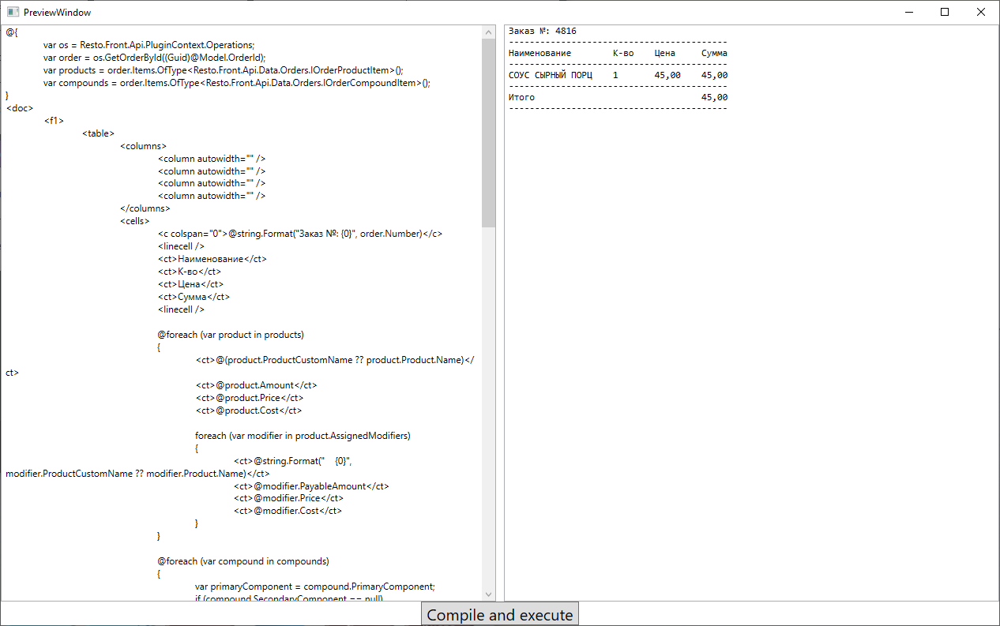

Опубликован новый пример [`SampleRazorRunner`](https://github.com/iiko/front.api.sdk/tree/master/sample/v8/Resto.Front.Api.SampleRazorRunner), который показывает возможности использования Razor разметки в комбинации с данными, полученными из Resto.Front.Api.

Данный пример имеет статический класс `RazorRunner`, который содержит 2 метода `UpdateRazorAssemblyReference` и `RunCompile`.

1. `UpdateRazorAssemblyReference(string restoApiAssemblyToUse, params string[] otherAssembliesToUse)` - данный метод позволяет обновить список сборок, содержимое которых будет использоваться для компиляции шаблона Razor. 
	1. Первый аргумент restoApiAssemblyToUse - обязательный. Компилятору необходимо знать какая именно версия API будет использоваться. 
	2. Второй аргумент - необязательный. Дополнительные сборки следует указывать, если они содержат какие-либо необходимые данные, методы, модели для шаблона, на использование которых у компилятора изначально нет инструкций. Несколько библиотек будут использоваться всегда, так как они необходимы для нормального функционирования компилятора:
		
		- mscorlib.dll
		- netstandard.dll
		- System.dll
		- System.Core.dll
		- RazorEngine.NetStandard.dll
		- Microsoft.CSharp.dll 

	Метод использует класс `ExternalAssemblyReferenceResolver`, который и описывает процесс обновления ссылок на ассамблеи для Razor.

2. `RunCompile(string template, object model)` - данный метод отвечает непосредственно за компиляцию шаблона Razor.
	1. `template` - шаблон в виде строки. Строку можно писать динамически или подгружать из файлов. Обычно расширение для Razor шаблона - .cshtml
	2. `model` - объект модели с заданным набором данных.
 
Стоит отметить, что модели для шаблонов могут быть двух типов:
	
- Статические - в данном случае компилятору передается `model`. Также может потребоваться передавать в `UpdateRazorAssemblyReference` в `otherAssembliesToUse` название dll в которой содержится данная модель.
- Динамические - в поле `model` передается динамически созданная модель. К примеру: `new { OrderNumber = 27, OrderId = PluginContext.Operations.GetOrders().Last().Id }`. Однако при таком методе задания данных внутри шаблона Razor должно быть пояснение типов для всех переданных данных: `(int)OrderNumber`, `(Guid)OrderId`.

Также пример имеет простое окно:

Оно позволяет динамически задавать шаблон и видеть полученный результат или сведения об ошибках. Изначально в SampleRazorRunner приложен пример разметки Razor - `RazorTemplateSample.cshtml`. Данный пример выводит некоторые данные об открытом заказе.

Если вы хотите использовать данный механизм в своём плагине, можете скопировать файл RazorRunner.cs и указать секцию о `System.Runtime.CompilerServices.Unsafe` в app.config.

При создании и использовании шаблонов Razor для печати в Resto.Front.Api стоит знать [`язык описания разметки iiko`](https://ru.iiko.help/articles/#!iikooffice-8-8/topic-5).

Далее будет представлен простой пример использования данного функционала:

    using RestoRazorRunner;
    using System;
    using System.Linq;
    using System.Xml.Linq;
    using Resto.Front.Api.Data.Print;
    
    namespace Resto.Front.Api.SamplePlugin
    {
    	public static class RazorRunnerSample
    	{
    		public static void RunCompileSample()
    		{
    			var os = PluginContext.Operations;
    
			    //Задаем простой Razor шаблон
			    var razorTemplate = "@{" +
			    "\r\nvar os = Resto.Front.Api.PluginContext.Operations;" +
			    "\r\nvar order = os.GetOrderById((Guid)@Model.OrderId);" +
			    "\r\n}" +
			    "\r\n<doc>" +
			    "\r\n@string.Format(\"Заказ \u2116: {0}\", order.Number)" +
			    "\r\n</doc>";
			    
			    var model = new SampleOrderModel { OrderId = os.GetOrders().Last().Id };
			    
			    //Указываем, какие библиотеки необходимо использовать.
			    RazorRunner.UpdateRazorAssemblyReference(
			    typeof(PluginContext).Assembly.ManifestModule.Name //Получает текущую используемую в плагине версию API
			    );
			    
			    //Получаем скомпилированный шаблон
			    var result = RazorRunner.RunCompile(razorTemplate, model);
			    
			    //Печатаем его через Resto.Front.Api
			    var printingDevice = os.GetPrintingDeviceInfos().Last();
			    os.Print(printingDevice, new Document { Markup = XElement.Parse(result) });			    
    		}
    
    		public sealed class SampleOrderModel
    		{
    			public Guid OrderId { set; get; }
    		}
    	}
    }

Альтернативно, можно вместо печати получить полностью отформатированный текст с помощью операции [`FormatDocumentOnPrintingDevice`](https://iiko.github.io/front.api.sdk/v8/html/M_Resto_Front_Api_IOperationService_FormatDocumentOnPrintingDevice.htm).